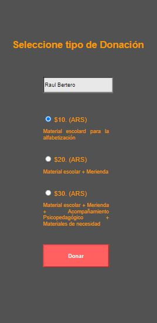
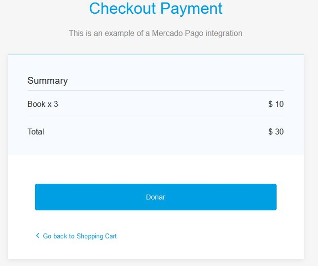
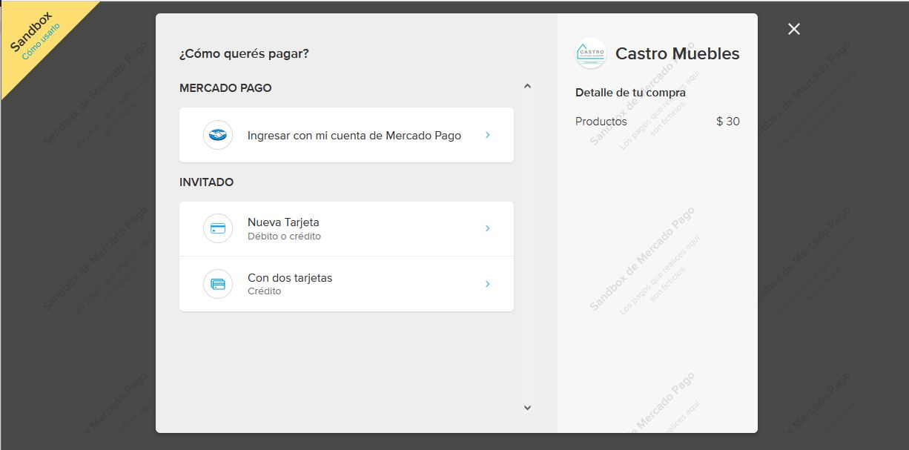
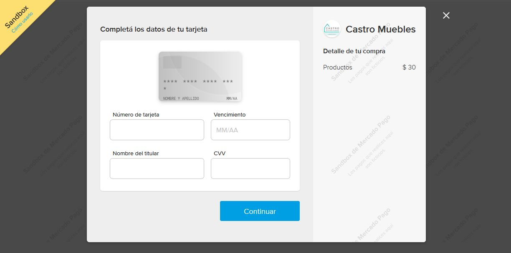

# APIs, NodeJS, Mercado Pago - Donacion (Donación)

Mini proyecto donde se implemente el boton de Pago/Donación provisto por Mercado Pago con NodeJS, JavaScript, HTML5, y CSS.

Vista Previa:

## Contacto: 

Autor: Esteban Della Nave

Linkedin: https://www.linkedin.com/in/estebandellanave/

cv: https://drive.google.com/file/d/1fcjC2SMSHGzpMTnW0IH-2xzp_Cc3wKcv/view?usp=sharing

Email: estebandellanave@gmail.com 

movil: (+54) 294 434-9130

## Resumen: 

Es un pequeño proyecto donde se implemta el sistema de pago provisto por Mecado Pago a travez de NodeJS/JS/HTML/CSS.

## Objetivo:

Objetivo: Implementar y probar el funcionamiento del  Crear un Carrusel con JS.
